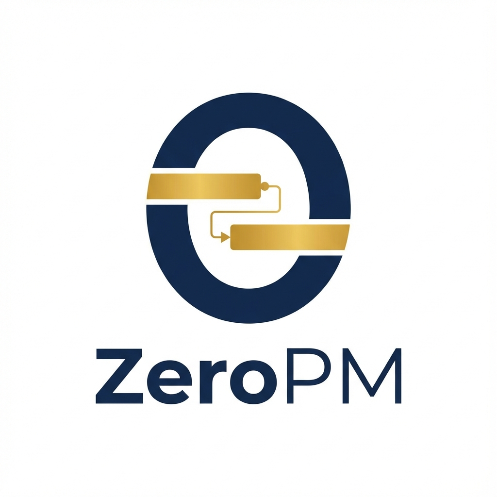

# ZeroPM (Zero-Cost Project Manager)

<div align="center">
  
</div>


> **"비용은 Zero, 기능은 Premium"**
>
> MS Project 수준의 고급 기능(CPM, DAG, Auto-scheduling)을 오픈소스와 무료 클라우드 인프라만으로 구현한 엔터프라이즈급 웹 기반 프로젝트 관리 도구입니다.

## 📖 프로젝트 개요

**ZeroPM**은 고가의 상용 PM 소프트웨어(MS Project, Primavera P6 등)가 가진 라이선스 비용 장벽을 허물기 위해 시작되었습니다.
본 프로젝트는 **'분리형 아키텍처(Decoupled Architecture)'**를 채택하여, UI 렌더링과 스케줄링 로직을 분리함으로써 비용 효율성과 고성능을 동시에 달성했습니다.

* **목표:** 개인 및 소규모 팀을 위한 완전 무료 엔터프라이즈 PM 도구 제공
* **핵심 가치:** 고성능 렌더링, 강력한 스케줄링 알고리즘, 실시간 협업

## ✨ 주요 기능 (Key Features)

* **⚡ 고성능 간트 차트 (High-Performance Gantt)**
    * SVAR React Gantt 기반의 가상화(Virtualization) 기술 적용.
    * 수천 개의 작업(Task)과 의존성(Dependency)을 60FPS로 부드럽게 렌더링.
* **🧠 지능형 자동 스케줄링 (Auto-Scheduling Engine)**
    * **DAG(방향성 비순환 그래프)** 기반의 자체 스케줄링 엔진 탑재.
    * **순환 참조 감지:** 의존성 루프 발생 시 즉각적인 감지 및 차단.
    * **CPM(임계 경로 분석):** 전진/후진 계산(Forward/Backward Pass)을 통해 최단 완료 시간 및 여유 시간(Float) 산출.
* **🤝 실시간 동시 편집 (Real-time Collaboration)**
    * **Google Docs 스타일 협업:** Yjs(CRDT)와 Supabase Realtime을 결합한 무충돌 동기화.
    * **프레즌스(Presence):** 다른 사용자가 편집 중인 작업을 시각적으로 표시(Soft Lock).
* **📅 비즈니스 캘린더 지원**
    * 주말 및 공휴일을 자동으로 제외한 '유효 작업 시간' 계산 로직 적용.

## 🛠 기술 스택 (Tech Stack)

| 구분 | 기술 선정 | 설명 |
| :--- | :--- | :--- |
| **Frontend** | **Next.js 16 / React 19.2** | 최신 React 동시성 모드 지원 및 서버 컴포넌트 활용. |
| **UI Library** | **SVAR React Gantt 2.3** | GPLv3 라이선스의 고성능 간트 차트 렌더링 엔진. |
| **Language** | **TypeScript 5** | 복잡한 스케줄링 알고리즘의 타입 안정성 보장. |
| **Backend/DB** | **Supabase** | PostgreSQL 기반의 데이터 저장소 및 인증(Auth) 처리. |
| **Sync** | **Yjs + Supabase Realtime** | CRDT 기반의 실시간 데이터 동기화 미들웨어. |
| **Deploy** | **Vercel** | 비용 제로 호스팅 환경 (Hobby Tier). |

## 🏗 아키텍처 (Architecture)

ZeroPM은 **View(렌더링)**와 **Brain(로직)**을 분리합니다.

1.  **View Layer:** SVAR React Gantt는 오직 화면에 그리는 역할만 수행합니다.
2.  **Logic Layer:** 사용자의 입력(드래그 앤 드롭 등)은 즉시 자체 개발된 **스케줄링 엔진(Graph Engine)**으로 전달됩니다.
3.  **Process:** 엔진은 위상 정렬(Topological Sort) → CPM 계산을 수행한 후, 확정된 날짜를 State에 업데이트합니다.

## 🚀 시작하기 (Getting Started)

### 사전 요구사항
* Node.js 18.x 이상
* Supabase 계정

### 설치 및 실행

1. **저장소 클론**
   ```bash
   git clone https://github.com/your-username/zero-pm.git
   cd zero-pm
   ```

2.  **의존성 설치**

    ```bash
    npm install
    # or
    yarn install
    ```

3.  **환경 변수 설정 (.env.local)**
    Supabase 프로젝트의 URL과 Anon Key를 설정합니다.

    ```bash
    NEXT_PUBLIC_SUPABASE_URL=your_supabase_project_url
    NEXT_PUBLIC_SUPABASE_ANON_KEY=your_supabase_anon_key
    ```

4.  **SVAR Gantt CSS 설정**
    
    SVAR React Gantt 라이브러리의 CSS 파일을 프로젝트에 복사합니다:
    
    ```bash
    # node_modules에서 CSS 파일 복사
    cp node_modules/@svar-ui/react-gantt/dist/index.css src/styles/gantt-svar.css
    ```
    
    > **⚠️ 중요:** Next.js의 Turbopack은 압축된 CSS 파일을 파싱하지 못하는 이슈가 있습니다. 
    > 따라서 `node_modules`에서 직접 import하는 대신, 로컬 `src/styles/` 디렉토리로 복사하여 사용합니다.

5.  **개발 서버 실행**

    ```bash
    npm run dev
    ```

    브라우저에서 [http://localhost:3000](http://localhost:3000)을 열어 확인하세요.

### 프로덕션 빌드

```bash
# 프로덕션 빌드 생성
npm run build

# 프로덕션 서버 실행
npm run start
```

### CSS 관련 문제 해결

만약 CSS 파싱 오류가 발생한다면:

1. **기존 CSS 파일 삭제**
   ```bash
   rm src/styles/gantt.css  # 압축된 파일 제거
   ```

2. **새로운 CSS 파일 복사**
   ```bash
   cp node_modules/@svar-ui/react-gantt/dist/index.css src/styles/gantt-svar.css
   ```

3. **컴포넌트에서 import 경로 확인**
   ```javascript
   // src/components/GanttView.jsx
   import "@/styles/gantt-svar.css";  // 올바른 경로
   ```

### 데이터베이스 설정 (Supabase SQL)

Supabase의 SQL Editor에서 다음 쿼리를 실행하여 테이블을 생성하세요.

```sql
-- 프로젝트 테이블
CREATE TABLE projects (
  id UUID PRIMARY KEY DEFAULT gen_random_uuid(),
  title TEXT NOT NULL,
  owner_id UUID REFERENCES auth.users(id),
  created_at TIMESTAMPTZ DEFAULT NOW()
);

-- 작업 테이블 (인접 리스트 모델)
CREATE TABLE tasks (
  id UUID PRIMARY KEY DEFAULT gen_random_uuid(),
  project_id UUID REFERENCES projects(id) ON DELETE CASCADE,
  parent_id UUID REFERENCES tasks(id),
  text TEXT NOT NULL,
  start_date TIMESTAMPTZ NOT NULL,
  duration INTEGER NOT NULL,
  progress FLOAT DEFAULT 0,
  type TEXT DEFAULT 'task'
);

-- 의존성 테이블 (정규화)
CREATE TABLE links (
  id UUID PRIMARY KEY DEFAULT gen_random_uuid(),
  source UUID REFERENCES tasks(id) ON DELETE CASCADE,
  target UUID REFERENCES tasks(id) ON DELETE CASCADE,
  type TEXT DEFAULT '0', -- 0: Finish-to-Start
  project_id UUID REFERENCES projects(id) ON DELETE CASCADE
);
```

## 🐛 알려진 이슈 및 해결 방법

### CSS 파싱 오류 (Turbopack)

**증상:**
```
Build Error: Parsing CSS source code failed
Invalid empty selector
```

**원인:** Next.js 16의 Turbopack이 압축된 CSS 파일의 특정 선택자를 파싱하지 못함.

**해결 방법:** 위의 "CSS 관련 문제 해결" 섹션 참조.

## 📚 참고 자료 (References)

### SVAR React Gantt 공식 자료

- **SVAR React Gantt 라이브러리**: https://github.com/svar-widgets/react-gantt.git
- **SVAR React Gantt 데모**: https://github.com/svar-widgets/react-gantt-demos.git
- **Gantt Backend (Go)**: https://github.com/svar-widgets/gantt-backend-go.git

### 내부 참고 프로젝트

- **ZeroPM v1**: `/Users/sheplim/develop/work/zero-pm-v1`
  - 작동하는 OAuth 구현 참고
  - Supabase 클라이언트 구조 참고
  - Gantt 차트 통합 예제

## 📜 라이선스

이 프로젝트는 **MIT License**를 따릅니다.
단, 포함된 `SVAR React Gantt` 라이브러리는 **GPLv3** 라이선스를 따르므로 상용 제품 개발 시 유의하시기 바랍니다.

## 🤝 기여하기

프로젝트에 기여하고 싶으시다면:

1. Fork the Project
2. Create your Feature Branch (`git checkout -b feature/AmazingFeature`)
3. Commit your Changes (`git commit -m 'Add some AmazingFeature'`)
4. Push to the Branch (`git push origin feature/AmazingFeature`)
5. Open a Pull Request

## 📧 문의

프로젝트 관련 문의사항이 있으시면 이슈를 등록해주세요.
