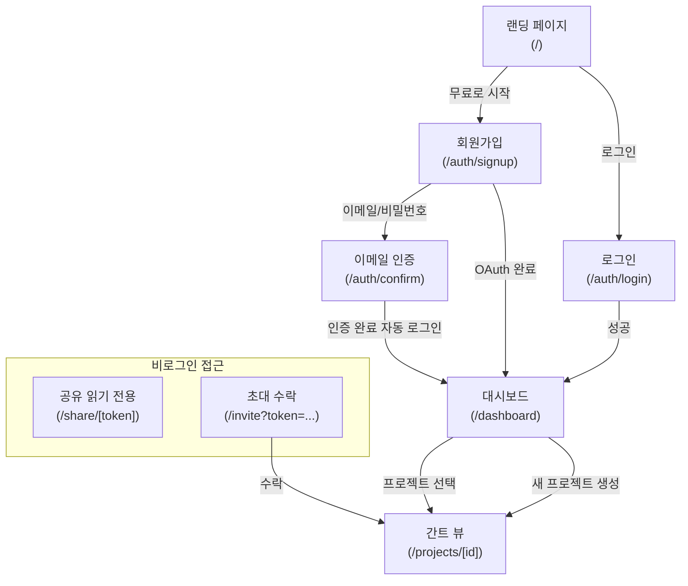
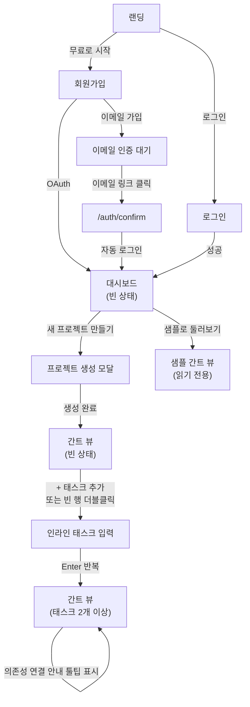
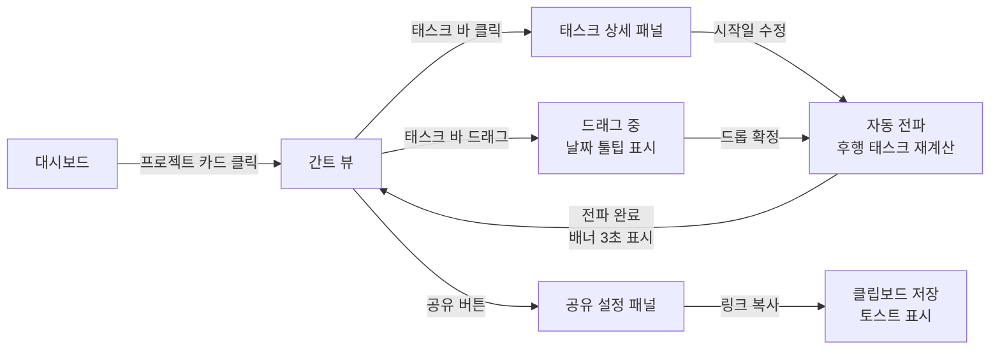
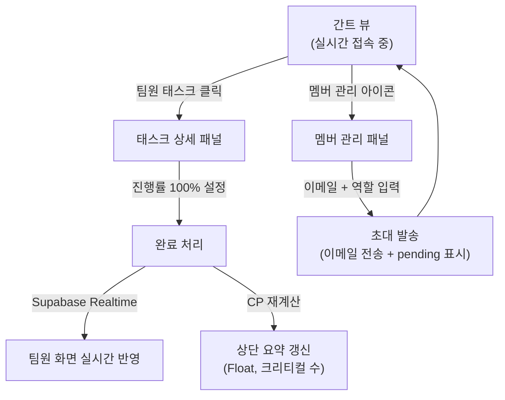
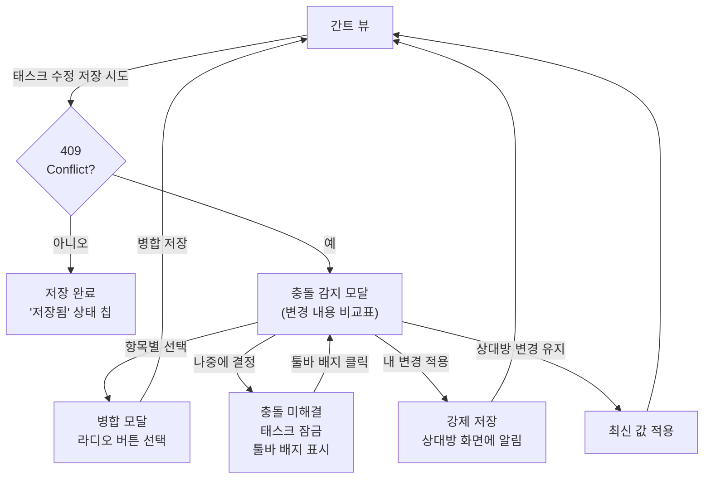
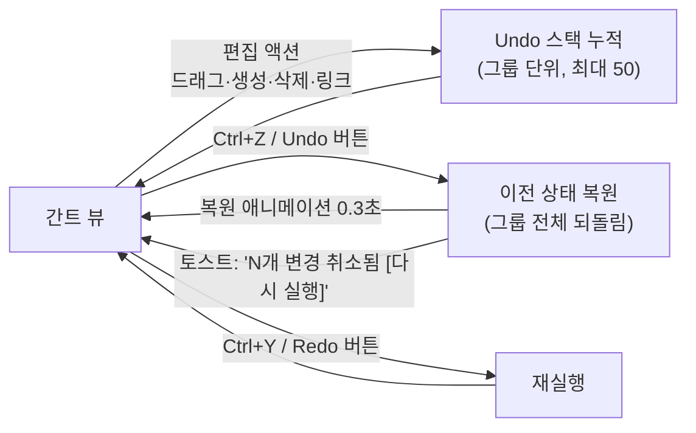
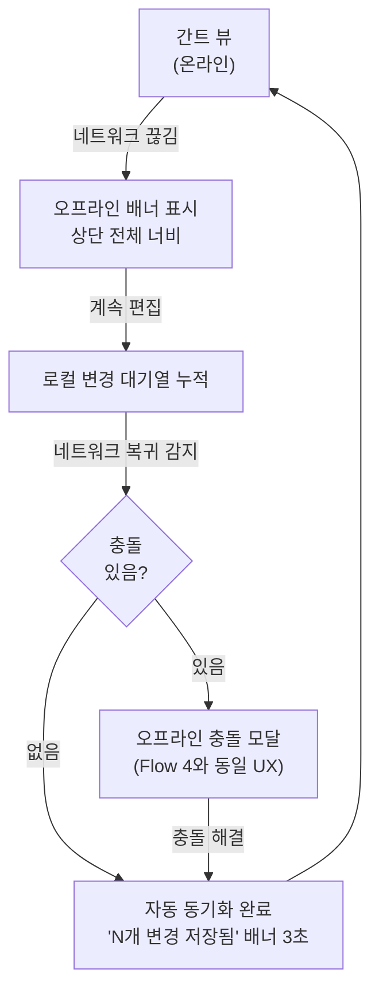
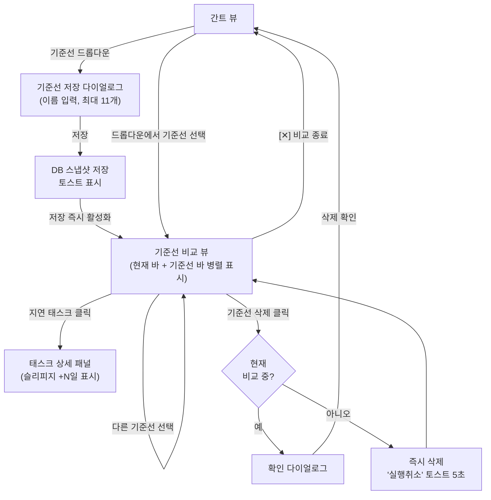
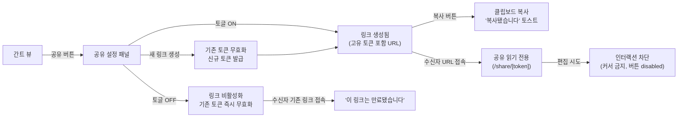
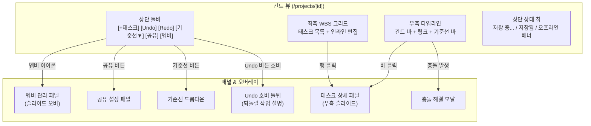

# ZeroPM 화면흐름도

> 주요 화면 간 이동 경로와 인터랙션 흐름을 시각적으로 정의한다.
> 각 플로우의 상세 단계·에러 케이스는 [`03-User-Flow-시나리오.md`](../../01-유저스토리/03-User-Flow-시나리오.md) 참조.

---

## 1. 전체 화면 구조 (Information Architecture)



---

## 2. 라우팅 구조

| 경로 | 화면 | 인증 필요 |
|------|------|----------|
| `/` | 랜딩 페이지 | ✗ |
| `/auth/login` | 로그인 | ✗ |
| `/auth/signup` | 회원가입 | ✗ |
| `/auth/confirm` | 이메일 인증 확인 | ✗ |
| `/invite?token=...` | 초대 수락 | △ (수락 후 로그인 유도) |
| `/dashboard` | 프로젝트 목록 | ✓ |
| `/projects/[id]` | 간트 뷰 | ✓ |
| `/share/[token]` | 공유 읽기 전용 | ✗ |

---

## 3. 플로우별 화면 흐름도

### 3-1. 온보딩 플로우 (Flow 1)



### 3-2. 프리랜서 PM 일간 작업 플로우 (Flow 2)



### 3-3. 팀 PM 협업 플로우 (Flow 3)



### 3-4. 충돌 해결 플로우 (Flow 4)



### 3-5. Undo/Redo 플로우 (Flow 5)



### 3-6. 오프라인 → 온라인 복귀 플로우 (Flow 6)



### 3-7. 팀원 초대 플로우 (Flow 7)

```mermaid
flowchart TD
    A["간트 뷰\n(Owner 권한)"] -->|멤버 관리 패널 열기| B["이메일 입력 + 역할 선택"]
    B -->|초대 보내기| C["초대 이메일 발송\npending 배지 표시"]

    C -->|수신자: 이메일 링크 클릭| D["/invite?token=..."]

    D -->|기존 가입자 + 로그인 상태| E["참여 확인 화면\n프로젝트 열기 버튼"]
    D -->|비로그인 상태| F["로그인 페이지\n(redirect 파라미터 유지)"]
    D -->|미가입 신규 사용자| G["회원가입\n(이메일 자동 입력·잠금)"]
    D -->|만료된 토큰 (48시간 초과)| H["'링크가 만료됐어요'\n(재초대 요청 안내)"]
    D -->|다른 계정 로그인 상태| I["'초대받은 이메일로 로그인하세요'\n(로그아웃 후 재로그인 버튼)"]

    F -->|로그인 완료| E
    G -->|가입 완료| E
    E -->|프로젝트 열기| J["간트 뷰\n(역할 권한 적용됨)"]
```

### 3-8. 기준선 저장·비교 플로우 (Flow 8)



### 3-9. 공유 링크 플로우 (Flow 9)



---

## 4. 간트 뷰 내부 화면 구조

간트 뷰(`/projects/[id]`)는 ZeroPM의 주 작업 화면으로, 레이아웃과 오버레이로 구성된다.



---

## 5. 권한별 화면 차이

| UI 요소 | Viewer | Editor | Owner |
|---------|--------|--------|-------|
| 간트 조회 | ✅ | ✅ | ✅ |
| 태스크 드래그·리사이즈 | 커서 금지 | ✅ | ✅ |
| 태스크 추가·삭제 | 버튼 비활성 | ✅ | ✅ |
| 링크(의존성) 생성·삭제 | 불가 | ✅ | ✅ |
| 기준선 저장 | 불가 | ✅ | ✅ |
| 멤버 관리 패널 | 미노출 | 목록 조회만 | 초대·제거 가능 |
| 프로젝트 설정·삭제 | 불가 | 불가 | ✅ |

> 태스크 상세 패널은 Viewer도 열 수 있으나 모든 입력 필드가 disabled 상태로 표시되며, 패널 하단에 "읽기 전용 — Viewer 권한" 레이블이 표시된다.

---

**문서 버전:** 2026-06-12  
**연관 문서:** [03-User-Flow-시나리오.md](../../01-유저스토리/03-User-Flow-시나리오.md) · [01-페르소나-사용자스토리맵.md](../../01-유저스토리/01-페르소나-사용자스토리맵.md) · [04-수용기준-AC.md](../../01-유저스토리/04-수용기준-AC.md)
