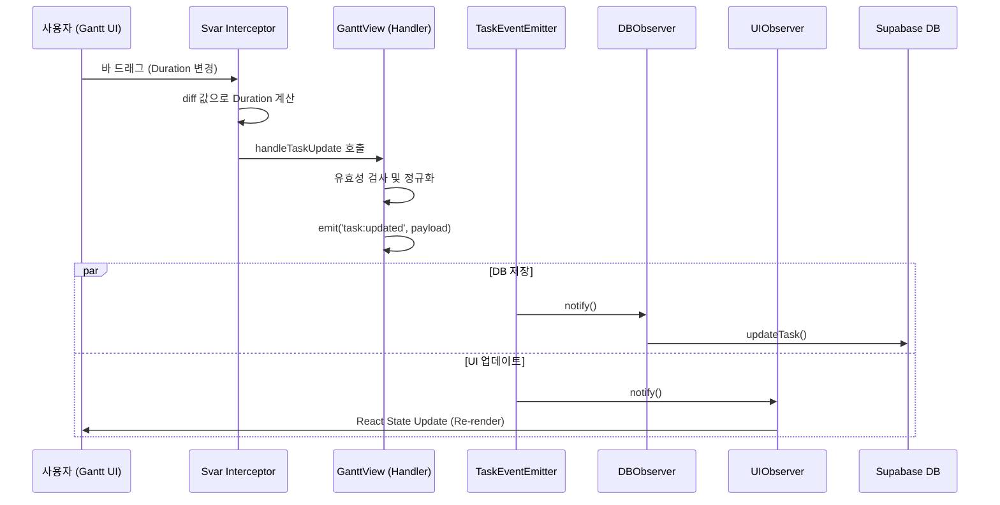

# 이벤트 기반 아키텍처 (Event-Driven Architecture) 설계

**작성일**: 2025-12-05
**상태**: 구현 완료 (Phase 1)

## 1. 개요
ZeroPM의 Gantt 차트, 데이터베이스 영속성, UI 업데이트, 그리고 CPM 스케줄링 엔진 간의 결합도를 낮추고 유지보수성을 높이기 위해 **Observer Pattern** 기반의 이벤트 구동 아키텍처를 도입했습니다.

기존의 명령형(Imperative) 방식에서는 `handleTaskUpdate` 함수 하나가 데이터 검증, DB 저장, 로컬 상태 업데이트, 스케줄링 재계산을 모두 직접 처리하여 코드가 비대해지고 디버깅이 어려웠습니다. 이를 이벤트 기반으로 전환하여 각 관심사를 분리했습니다.

## 2. 핵심 컴포넌트

### 2.1 TaskEventEmitter (Publisher)
- **역할**: 중앙 이벤트 관리자. 애플리케이션 전역에서 발생하는 Task/Link 관련 이벤트를 수신하고, 등록된 Observer들에게 전파합니다.
- **위치**: `src/lib/taskEventEmitter.ts`
- **주요 기능**:
  - `on(event, handler)`: 이벤트 리스너 등록
  - `off(event, handler)`: 이벤트 리스너 제거
  - `emit(event, payload)`: 이벤트 발생

### 2.2 Observers (Subscribers)
각 Observer는 특정 도메인의 관심사만을 처리합니다.

1. **DBObserver**
   - **역할**: 데이터 영속성 관리
   - **위치**: `src/lib/taskObservers.ts`
   - **기능**: `task:updated` 등의 이벤트를 받아 Supabase에 변경사항을 저장합니다.
   
2. **UIObserver**
   - **역할**: 사용자 인터페이스 상태 동기화
   - **위치**: `src/lib/taskObservers.ts`
   - **기능**: React State(`tasks`, `links`)를 최신 데이터로 업데이트하여 화면을 다시 그립니다.

3. **ScheduleObserver** (구현 진행 중)
   - **역할**: CPM 스케줄링 엔진 연동
   - **위치**: `src/lib/taskObservers.ts`
   - **기능**: Task 변경 시 종속된 후행 태스크(Successors)를 찾아 일정을 재계산합니다.

## 3. 이벤트 정의

| 이벤트 명 | 발생 시점 | Payload 포함 정보 | 처리 내용 |
|---|---|---|---|
| `task:created` | 새 작업 생성 시 | `task` (전체 객체) | DB Insert, UI 추가 |
| `task:updated` | 작업 속성 변경 시 (드래그 포함) | `task` (병합된 객체), `updates` (변경분), `changesAffectSchedule` (플래그) | DB Update, UI 갱신, (필요시) 재계산 |
| `task:deleted` | 작업 삭제 시 | `taskId` | DB Delete, UI 제거 |
| `link:created` | 의존성 연결 시 | `link` | DB Insert, UI 추가, 재계산 |
| `link:updated` | 링크 속성 변경 시 | `link` | DB Update, UI 갱신, 재계산 |
| `link:deleted` | 링크 삭제 시 | `linkId` | DB Delete, UI 제거, 재계산 |

## 4. 데이터 흐름 (Data Flow)

### 4.1 Task Update Flow (예: Gantt Bar Drag)

## 5. 주요 구현 상세

### 5.1 Gantt Interceptor
Svar Gantt 라이브러리의 동작을 가로채서 커스텀 로직을 주입합니다.
- `update-task`: 바 이동/드래그 시 발생. `diff` 파라미터를 사용하여 정확한 날짜/기간 변경을 계산합니다.
- `resize-task`: 바 크기 조정 시 발생.

### 5.2 타임존 처리 (Timezone Handling)
- **문제**: 브라우저 로컬 시간과 UTC 간의 변환 오차로 날짜가 하루씩 밀리는 현상 발생.
- **해결**: 
  - `dateUtils.ts`의 `parseToUTC` 함수 강화.
  - UTC 문자열(`Z`, `+00:00`)과 이미 UTC로 변환된 Date 객체를 감지하여 이중 변환을 방지.

## 6. 기대 효과
1. **결합도 감소**: 비즈니스 로직(DB 저장)과 UI 로직이 분리되어 독립적으로 수정/테스트 가능합니다.
2. **확장성**: 추후 '알림 발송', '로그 기록' 등의 기능을 추가할 때 기존 코드를 수정하지 않고 새 Observer만 등록하면 됩니다.
3. **유지보수성**: 로직의 흐름이 명확해지고 디버깅이 용이해집니다.
